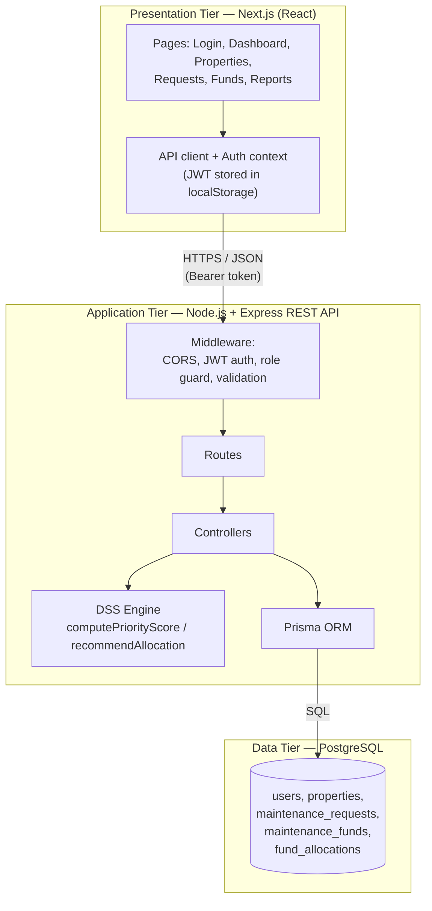
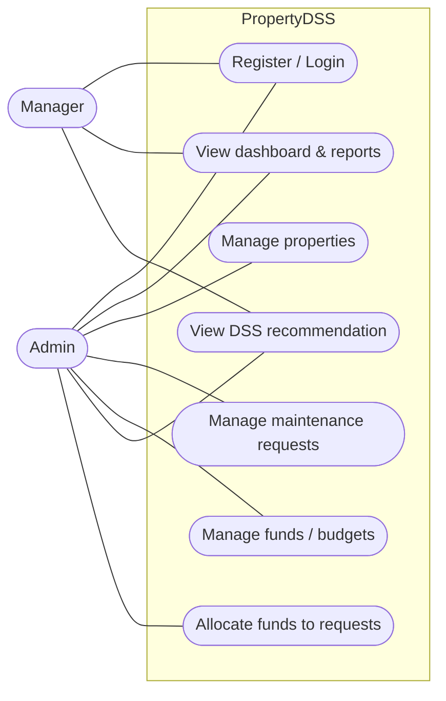
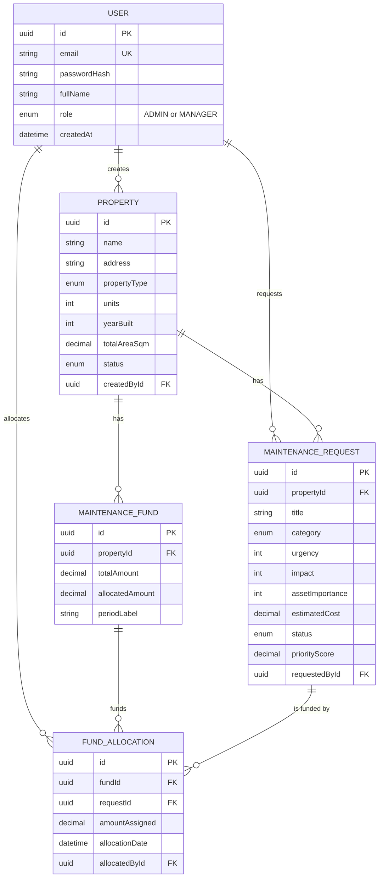
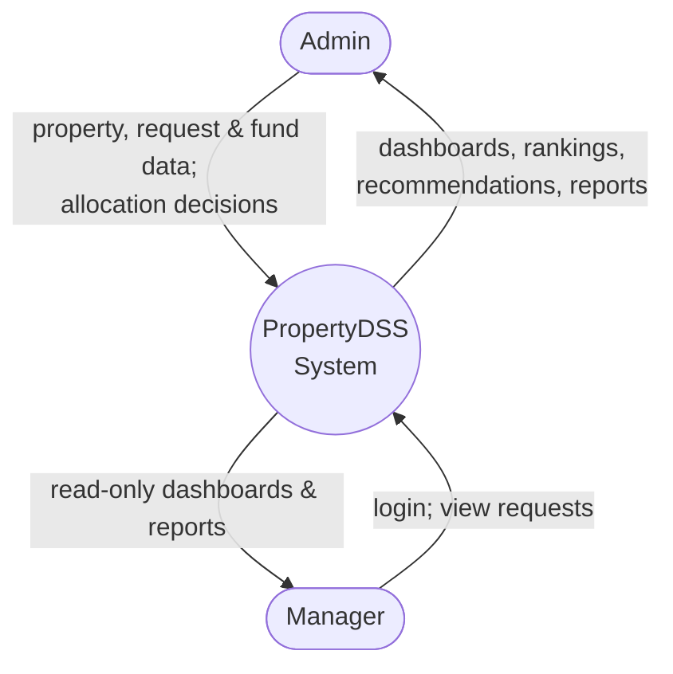
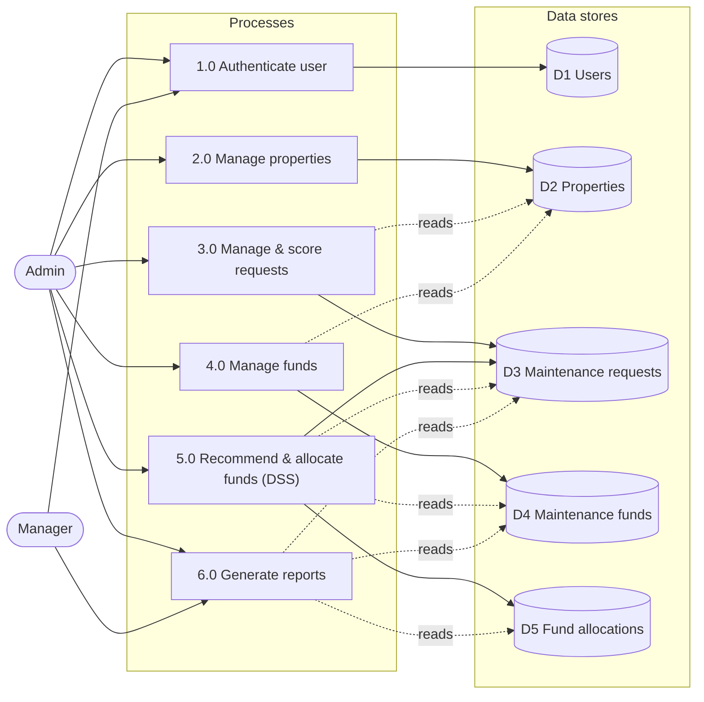
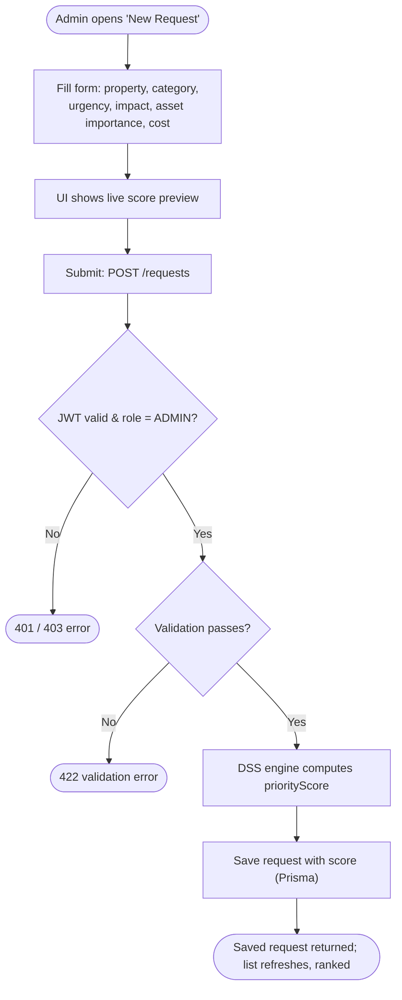
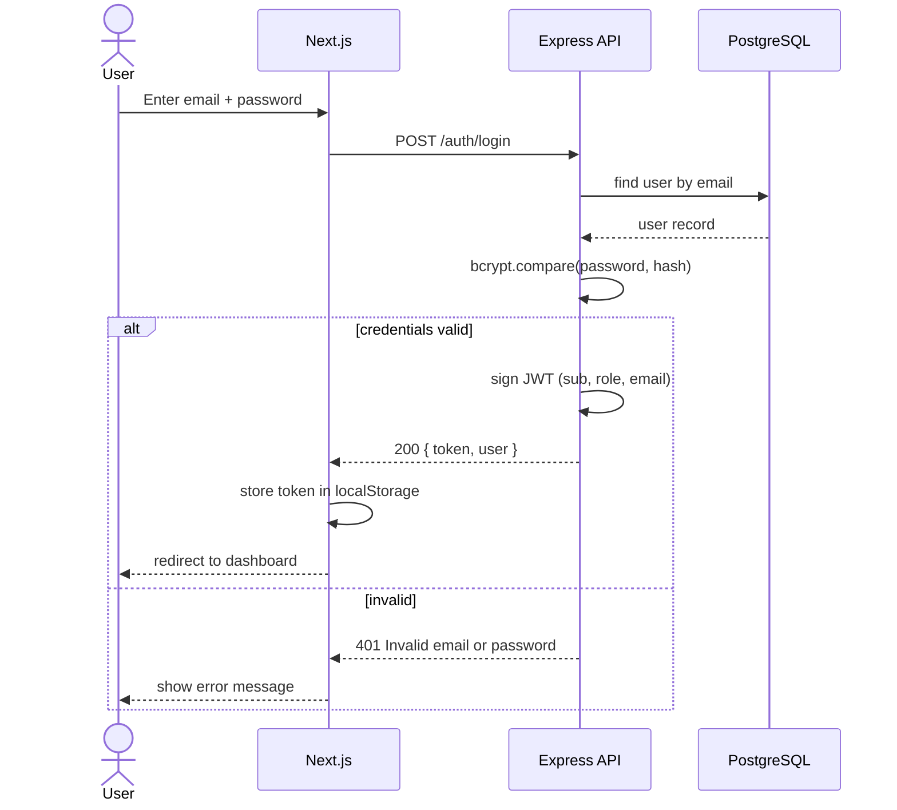
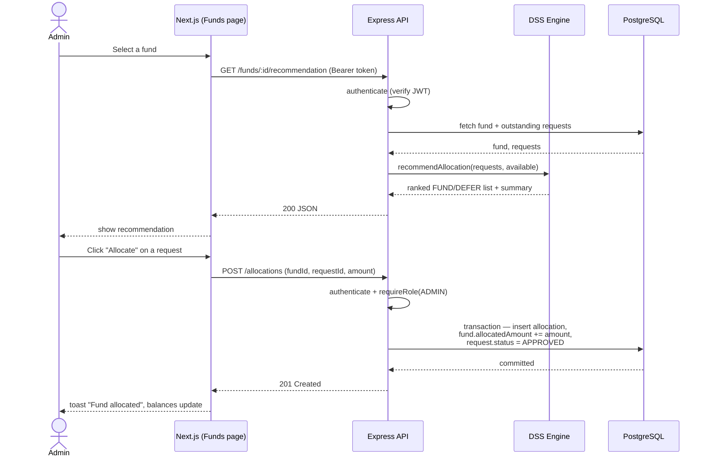
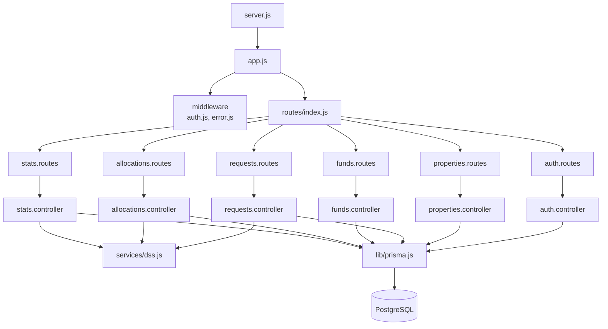

# PropertyDSS — System Diagrams

All diagrams below are written in [Mermaid](https://mermaid.js.org/) and reflect the
system as actually implemented. They render automatically on GitHub, in VS Code (with a
Mermaid preview extension), or by pasting into <https://mermaid.live>.

## 1. System architecture (three-tier)

---

## 2. Use case diagram

The Manager is view-only; the Admin can manage data and allocate funds.

---

## 3. Entity-Relationship diagram (database)

---

## 4. Data flow diagram — context (level 0)

---

## 5. Data flow diagram — level 1

---

## 6. DSS algorithm flowchart (priority scoring + budget allocation)

---

## 7. Activity — logging a maintenance request (server-side scoring)

---

## 8. Sequence — authentication (JWT)

---

## 9. Sequence — DSS recommendation and fund allocation

---

## 10. Backend module structure

